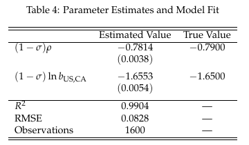

# Estimation

### 1. Guess values for $a_{1}$ and $a_{2}$

```matlab
params0 = [-0.8, -1.7];  % Initial guess [a1, a2]
lb = [-1.6, -3.4];       % Lower bounds
ub = [0, 0];             % Upper bounds
```
>**Note**: Based on the estimates from the paper, I set the bounds roughly. Since this exercise is intended to getting the hang of the methodology used in the paper, one cannot learn important things from the specific numbers.

### 2. Solve for $\\{P_{i}\\}$ using the market clearing conditions for all $j$.

Denote $T_{i}=P_{i}^{1-\sigma}$. Then the market clearing condition becomes simpler.

```matlab
function T = solve_T_system(a1, a2, y, d, delta, n_regions)
    
    theta = y / sum(y);
    T = ones(n_regions, 1);
    
    max_iter = 1000;
    tol = 1e-10;
    
    for iter = 1:max_iter
        T_old = T;
        
        for j = 1:n_regions
            sum_val = 0;
            for i = 1:n_regions
                exp_term = exp(a1 * log(d(i,j)) + a2 * (1 - delta(i,j)));
                sum_val = sum_val + (1/T_old(i)) * theta(i) * exp_term;
            end
            T(j) = sum_val;
        end
        
        % Normalize
        T = T / T(1);
        
        % Check convergence
        if max(abs(T - T_old)) < tol
            return;
        end
    end
    
    warning('T did not converge');
end
```
>Note: In order to calculate the multilateral resistance terms, full information for all regions is required. Thus, the integrated region (region 41) must be used to solve for $\\{P_{i}\\}$, while region 41 is excluded from the nonlinear squared estimation.

### 3. Calculate the nonlinear least squares objective

Define ```data_opt``` as a data set containing 40 regions.

```matlab
% Compute residuals
function residuals = compute_residuals(params, data_opt, y, d, delta, n_regions)
    % Compute residuals for NLSQ
    
    a1 = params(1);
    a2 = params(2);
    
    % Inner loop: Solve for T_i (multilateral resistance)
    T = solve_T_system(a1, a2, y, d, delta, n_regions);
    
    % Compute predicted ln(z_ij)
    n_obs = size(data_opt,1);
    predicted = zeros(n_obs, 1);
    
    for obs = 1:n_obs
        i = data_opt.origin_id(obs);
        j = data_opt.destination_id(obs);
        
        predicted(obs) = a1 * data_opt.ln_d(obs) + a2 * (1 - data_opt.border_dummy(obs)) ...
                        - log(T(i)) - log(T(j));
    end
    
    % Add constant
    k = mean(data_opt.ln_z) - mean(predicted);
    predicted = predicted + k;
    
    % Return residuals
    residuals = data_opt.ln_z - predicted;
end
```

### 4. If the difference between $\ln{z_{ij}}$ from the data and the prediction is below a tolerance level, stop.
### 5. Otherwise, return to step 1.

```matlab
% Define objective function
objective_fun = @(params) compute_residuals(params, data_opt, y, d, delta, n_regions);

% Run optimization
tic;
[params_hat, resnorm, residuals, exitflag, output] = lsqnonlin(...
    objective_fun, params0, lb, ub, options);
elapsed = toc;
```

# Result

<p align="center">

</p>

>Note: Robust standard errors are in parentheses. True values are from the paper, and since my data set is constructed based on the estimates of the paper, I call them 'True Value'.